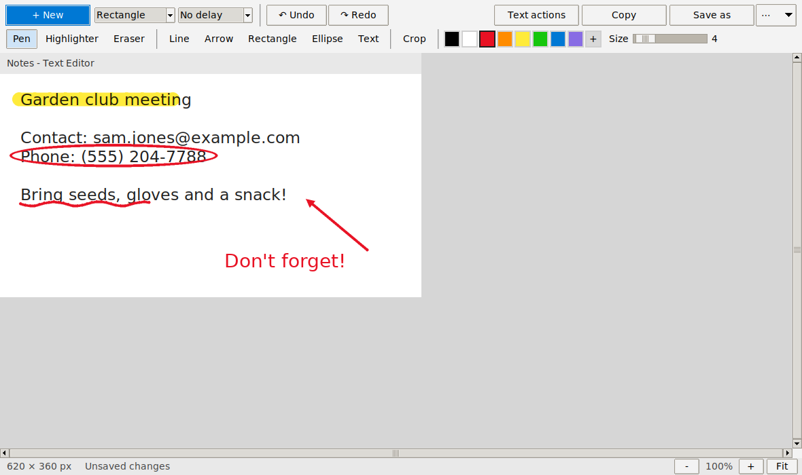

# PiSnip: a Snipping Tool for Raspberry Pi 400


A Windows 11 Snipping Tool look-alike for Raspberry Pi OS. Screenshots save automatically to **Pictures/Screenshots** and are copied to the clipboard.



The full illustrated user manual is in [PiSnip-Manual.pdf](PiSnip-Manual.pdf).

## Install (on the Pi)

1. Download this repo to the Pi (green **Code** button → **Download ZIP**, or `git clone https://github.com/hardwaremack-prog/pisnip`) and unzip it.
2. Open a Terminal in the unzipped folder and run:

   ```
   bash install.sh
   ```

3. That's it. A **Snipping Tool** icon appears on your **desktop** and on the **taskbar** (next to the browser, file manager and terminal), and in the menu under **Accessories**. Right-click the menu or desktop icon for quick **New snip** and **Record screen** actions.

If the taskbar icon doesn't show up straight away, log out and back in. If it's still missing, right-click the taskbar → **Add / Remove Plugins…** (or **Panel Settings → Launcher**) and add *Snipping Tool*. You can re-add the icons at any time from Settings → **Add icons**.

| Shortcut | Does |
|---|---|
| **Print Screen** | New snip |
| **Raspberry key + Shift + S** | New snip (same as Win + Shift + S) |
| **Raspberry key + Shift + R** | Record the screen |

If a shortcut doesn't respond straight away, log out and back in once.

## Features

**Main window** — just like Windows: a Snip / Record toggle (camera and video-camera buttons), a blue **+ New** button, a snipping-mode menu, a time-delay menu (No delay, 3, 5 or 10 seconds) and a ⋯ menu with Settings, Open file, folders, icons and shortcuts. Your choices are remembered.

**Snipping**
- Rectangle, Window, Freeform and Full screen modes. You can switch between them on the frozen screen.
- Delay of none, 3, 5 or 10 seconds, with an on-screen countdown.
- Auto-save as `Screenshot YYYY-MM-DD HHMMSS.png` in Pictures/Screenshots.
- Auto-copy to the clipboard, so you can paste straight into a chat or document.
- The pointer turns into a **crosshair** as soon as the screen freezes, with faint guide lines across the screen so you can line up your snip (you can turn the lines off in Settings).
- A **preview pop-up** slides in at the bottom-right after every shortcut snip, showing the picture you just took, like Windows. Click it to mark up the snip; it disappears by itself after a few seconds. Snips started from the **+ New** button open straight in the editor.
- Optional border on every screenshot.

**Editor (mark-up)**
- Pen, Highlighter, and an Eraser that removes whole strokes.
- Line, Arrow, Rectangle, Ellipse and Text.
- Crop.
- Colour palette plus a custom colour, and a size slider.
- Undo and Redo, Erase all ink, Revert to original.
- Zoom (Ctrl + mouse wheel, Ctrl +/−/0, Fit).
- Copy, Save as (PNG, JPG or GIF), Open file, Print, and open the Screenshots folder.
- **Text actions** (OCR): read the text in a snip and copy it, *Quick redact* emails and phone numbers, or redact all text.

**Screen recording**
- Pick an area or the full screen, then Start (with a 3-2-1 countdown) and Stop.
- Saves an .mp4 to Videos/Screen Recordings.

**Settings** (⋯ menu → Settings): save folders, auto-save and auto-copy, format, "ask to save edits", open the editor after shortcut snips, multiple windows, border, recording frame rate, and a system check that shows which helper tools are installed.

## Keyboard shortcuts in the editor
Ctrl+N new snip · Ctrl+S save as · Ctrl+C copy · Ctrl+Z / Ctrl+Y undo/redo · Ctrl+O open · Ctrl+P print · Ctrl+W close · Enter to apply a crop · Esc to cancel

## Notes
- **Window mode** needs the X11 desktop. On the default Wayland desktop, apps can't see where other windows are, so PiSnip asks you to drag around the window instead. To get click-a-window snips, switch to X11: `sudo raspi-config` → Advanced Options → Wayland → X11, then reboot.
- Recordings have no sound.
- Text actions use Tesseract, which can take a few seconds on a Pi 400.
- To let the desktop icon open with one double-click (no "Execute?" question), the installer turns on the file manager's *Don't ask options on launch executable file* setting.
- The installer backs up any desktop config it changes (`*.pisnip-backup`). `bash uninstall.sh` removes PiSnip and restores those backups.

## Command line
```
pisnip                 open PiSnip
pisnip --snip          snip now (add --mode rectangle|window|freeform|full, --delay 3|5|10)
pisnip --full          full-screen capture right away
pisnip --record        record the screen
pisnip picture.png     open an image in the editor
pisnip --setup-hotkeys re-create the keyboard shortcuts
pisnip --setup-shortcuts re-create the desktop, taskbar and menu icons
```
